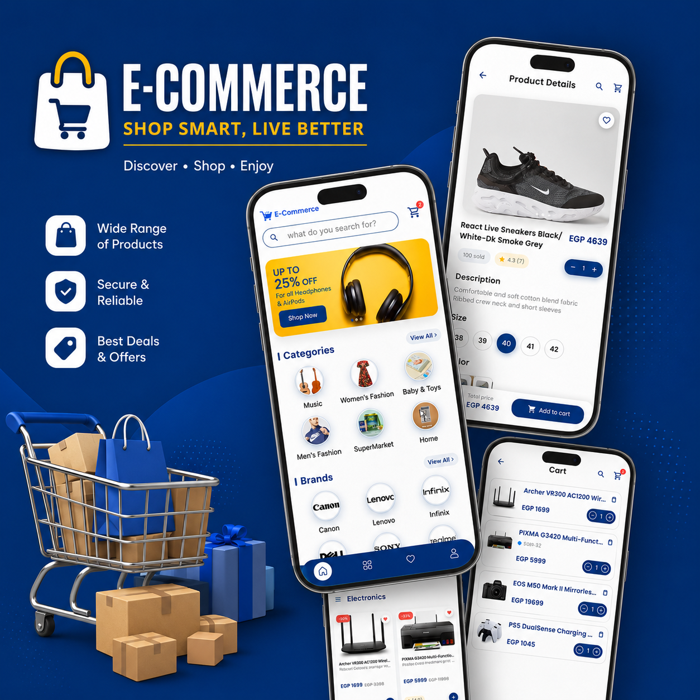
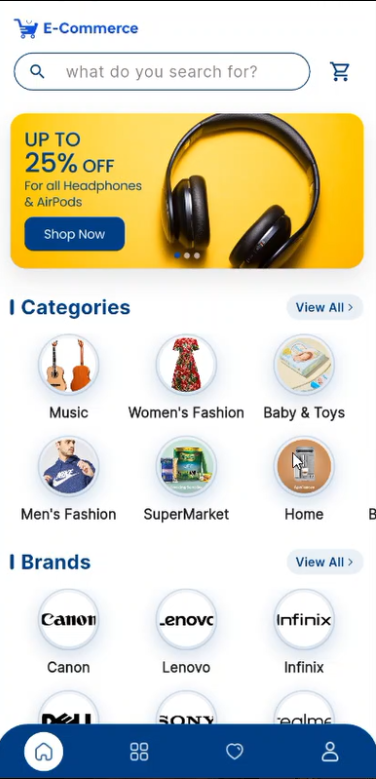
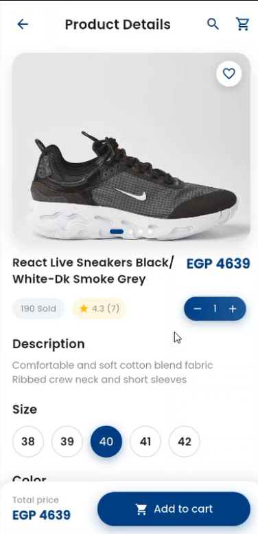
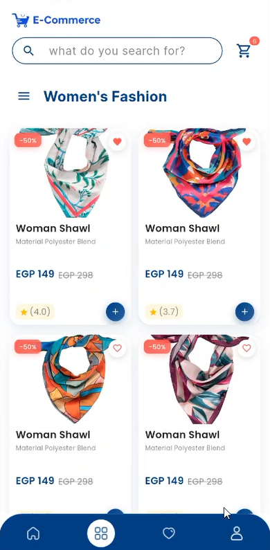
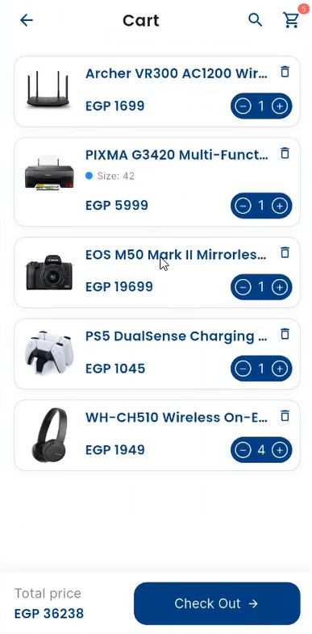

<div align="center">


# 🛍️ E-Commerce App

### A modern Flutter E-Commerce application built using **MVVM**, **Clean Architecture**, **Bloc/Cubit**, and **REST APIs**.

<p>


</p>



### 🛒 Discover • Shop • Enjoy

</div>

---

# 📖 Overview

E-Commerce App is a full-featured Flutter shopping application that consumes a **real REST API** provided by the **Route Academy E-Commerce Backend**.

The project follows **MVVM + Clean Architecture**, providing a scalable, maintainable, and production-ready codebase. It demonstrates modern Flutter development practices, including state management, dependency injection, API integration, local caching, and responsive UI design.

---

# ✨ Features

## 🔐 Authentication

- Login
- Register
- Persistent Login
- Secure Token Storage

## 🏠 Home

- Promotional Banner Slider
- Categories
- Brands
- Featured Products

## 🛍️ Products

- Product Details
- Product Images
- Product Description
- Ratings
- Price & Discount
- Available Sizes

## ❤️ Wishlist

- Add Product
- Remove Product
- Real-time Wishlist Updates

## 🛒 Shopping Cart

- Add to Cart
- Update Quantity
- Remove Items
- Total Price Calculation

## ⚡ Other Features

- Responsive UI
- Cached Network Images
- Loading States
- Error Handling
- Smooth Navigation
- Persistent User Session

---

# 🏛️ Architecture

The project follows **MVVM (Model-View-ViewModel)** combined with **Clean Architecture**.

```
Presentation Layer
       │
       ▼
Cubit (ViewModel)
       │
       ▼
Use Cases
       │
       ▼
Repository
       │
       ▼
Remote & Local Data Sources
```

This architecture separates business logic from the UI, making the application easier to maintain, test, and scale.

---

# 📂 Project Structure

```text
lib
│
├── api
│   ├── data_sources
│   ├── dio
│   ├── mappers
│   └── model
│
├── config
│
├── core
│   ├── cache_save_data
│   ├── exceptions
│   └── utils
│
├── data
│   ├── data_sources
│   ├── model
│   └── repository
│
├── domain
│   ├── entities
│   ├── repository
│   └── use_cases
│
├── features
│   ├── auth
│   ├── home
│   ├── products
│   ├── cart
│   ├── wishlist
│   └── profile
│
├── widget
│
└── main.dart
```

---

# 🧠 State Management

This project uses **Flutter Bloc (Cubit)** for predictable and scalable state management.

Each feature has its own Cubit responsible for:

- Loading Data
- API Requests
- Success States
- Error States
- Loading Indicators

Implemented Cubits include:

- Login Cubit
- Register Cubit
- Home Cubit
- Products Cubit
- Cart Cubit
- Wishlist Cubit
- Navigation Cubit

---

# 🌐 Backend

The application consumes a real **RESTful API** from **Route Academy E-Commerce API**.

Implemented modules include:

- Authentication
- Products
- Categories
- Brands
- Wishlist
- Shopping Cart

Networking stack:

- Dio
- Retrofit
- JSON Serialization
- DTO Models
- Model Mapping

---

# 💾 Local Storage

SharedPreferences is used to persist user data.

Stored data includes:

- Authentication Token
- Login Session

Application startup flow:

```
App Launch
     │
     ▼
Check Saved Token
     │
 ┌───┴─────────┐
 │             │
 ▼             ▼
Home        Login
```

---

# ⚙️ Dependency Injection

Dependency Injection is implemented using:

- GetIt
- Injectable

This keeps the project loosely coupled and improves maintainability.

---

# 📦 Packages Used

| Package | Purpose |
|----------|----------|
| flutter_bloc | State Management |
| dio | HTTP Client |
| retrofit | REST API |
| get_it | Service Locator |
| injectable | Dependency Injection |
| shared_preferences | Local Storage |
| cached_network_image | Image Caching |
| flutter_screenutil | Responsive UI |
| flutter_image_slideshow | Banner Slider |
| json_serializable | JSON Parsing |
| logger | Logging |
| pretty_dio_logger | API Logging |
| google_fonts | Custom Fonts |

---

# 📸 Screenshots

| Home | Products |
|------|----------|
|  |  |

| Product Details | Categories |
|-----------------|------------|
|  |  |

| Shopping Cart |
|---------------|
|  |

---

# 🚀 Getting Started

## Clone Repository

```bash
git clone https://github.com/ahmedmostafa361/E_Commerce_app.git
```

## Navigate to Project

```bash
cd E_Commerce_app
```

## Install Dependencies

```bash
flutter pub get
```

## Generate Required Files

```bash
dart run build_runner build --delete-conflicting-outputs
```

## Run the Application

```bash
flutter run
```

---

# 🎥 Demo Video

Watch the application in action:

https://youtu.be/1p28urLxZ_w

---

# 🛠️ Tech Stack

- Flutter
- Dart
- MVVM
- Clean Architecture
- Bloc / Cubit
- Dio
- Retrofit
- GetIt
- Injectable
- SharedPreferences
- Cached Network Image
- ScreenUtil

---

# 👨‍💻 Developer

## Ahmed Mostafa

**Flutter Developer**

📧 LinkedIn

https://www.linkedin.com/in/ahmed-mostafa-041690375/

💻 GitHub

https://github.com/ahmedmostafa361

📂 Repository

https://github.com/ahmedmostafa361/E_Commerce_app

---

<div align="center">

### ⭐ If you found this project useful, consider giving it a star!

</div>
